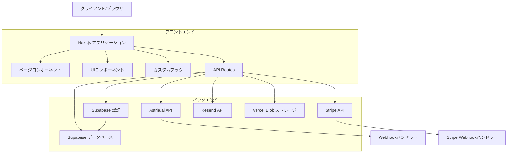
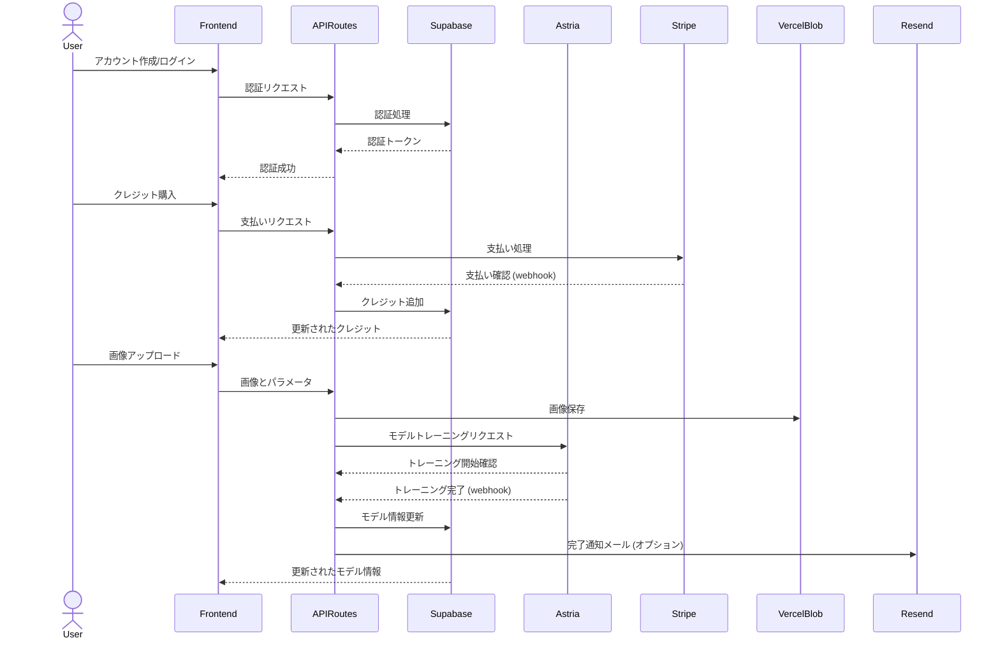

# システムパターン

## システムアーキテクチャ

Headshot AI は、モダンなウェブアプリケーションアーキテクチャを採用しており、フロントエンド、バックエンド、外部サービスの統合から構成されています。



## 主要な技術的決定

1. **Next.js**: サーバーサイドレンダリング、API ルート、ファイルベースのルーティングを提供する React フレームワークを採用
2. **Supabase**: 認証とデータベースのためのバックエンドサービスとして選択
3. **Astria.ai API**: AI モデルのトレーニングと推論のための外部サービス
4. **Vercel Blob**: 画像アップロードと保存のためのストレージソリューション
5. **Stripe**: 支払い処理のための安全で信頼性の高いサービス
6. **Resend**: メール通知のためのサービス（オプション）
7. **Tailwind CSS と Shadcn**: スタイリングとコンポーネントライブラリ

## デザインパターン

### 1. サーバーレスアーキテクチャ

アプリケーションはサーバーレスアーキテクチャを採用しており、Vercel でホストされる Next.js アプリケーションと、Supabase のマネージドバックエンドサービスを使用しています。これにより、インフラストラクチャの管理が簡素化され、スケーラビリティが向上します。

### 2. API ルートパターン

Next.js の API ルートを使用して、外部サービス（Astria.ai、Stripe など）とのインタラクションを処理します。これにより、API キーなどの機密情報をクライアントサイドに公開することなく、安全に外部サービスと通信できます。

```
/app/astria/train-model/route.ts  # Astria.ai モデルトレーニング API
/app/astria/train-webhook/route.ts  # Astria.ai webhook ハンドラー
/app/stripe/subscription-webhook/route.ts  # Stripe webhook ハンドラー
```

### 3. Webhook パターン

非同期処理（モデルトレーニング、支払い処理など）の完了通知を受け取るために Webhook パターンを使用しています。これにより、長時間実行されるプロセスの状態を効率的に追跡できます。

### 4. クレジットベースのシステム

ユーザーアクションに対してクレジットを消費するクレジットベースのシステムを実装しています。1 クレジット = 1 モデルトレーニングという単純な構造です。

### 5. コンポーネントベースのアーキテクチャ

UI は再利用可能なコンポーネントに分割されており、Shadcn UI ライブラリを基盤としています。これにより、一貫性のあるデザインと効率的な開発が可能になります。

## コンポーネント関係

### データフロー



### 主要コンポーネント

1. **認証システム**: Supabase Auth を使用したマジックリンク認証
2. **モデルトレーニングシステム**: Astria.ai API を使用したカスタム AI モデルのトレーニング
3. **画像生成システム**: トレーニングされたモデルを使用したヘッドショット生成
4. **支払いシステム**: Stripe を使用したクレジットベースの課金
5. **通知システム**: Resend を使用したメール通知（オプション）

## 重要な実装パス

### ユーザー認証フロー

1. ユーザーがメールアドレスを入力
2. Supabase がマジックリンクをメールで送信
3. ユーザーがリンクをクリック
4. コールバックハンドラーがトークンを検証
5. 認証成功後、ユーザーはダッシュボードにリダイレクト

### モデルトレーニングフロー

1. ユーザーが画像をアップロード（Vercel Blob に保存）
2. トレーニングリクエストが Astria.ai API に送信
3. Supabase でモデルレコードが作成（ステータス: トレーニング中）
4. トレーニング完了時に Webhook が呼び出される
5. モデルステータスが更新され、オプションでメール通知が送信

### ヘッドショット生成フロー

1. ユーザーがトレーニング済みモデルを選択
2. ユーザーがスタイルを選択（または Astria Packs API から取得）
3. 生成リクエストが Astria.ai API に送信
4. 生成された画像が返され、ユーザーに表示

### 支払いフロー

1. ユーザーがクレジットパッケージを選択
2. Stripe チェックアウトセッションが作成
3. ユーザーが Stripe で支払いを完了
4. Stripe Webhook が呼び出され、ユーザーのクレジットが更新
